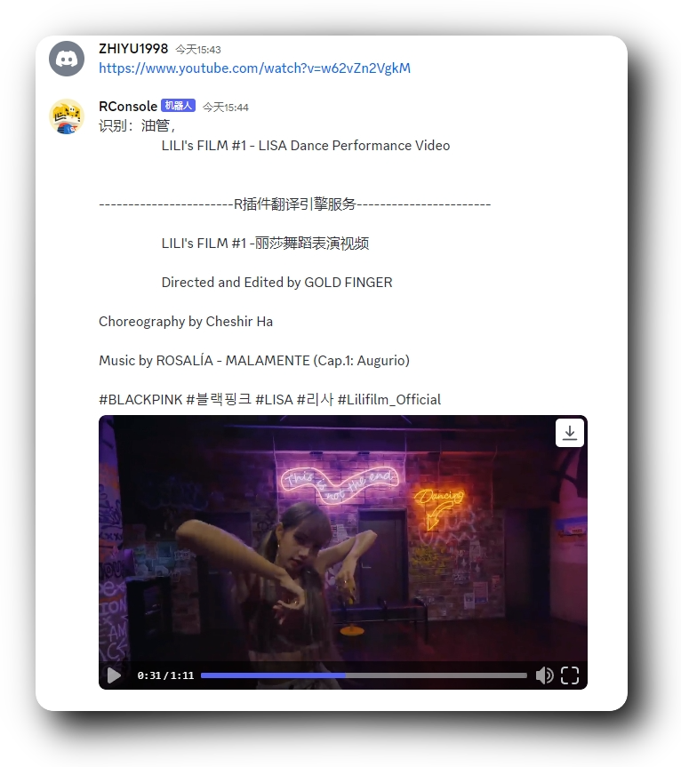
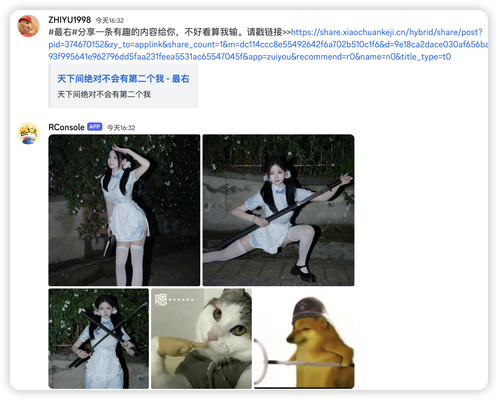
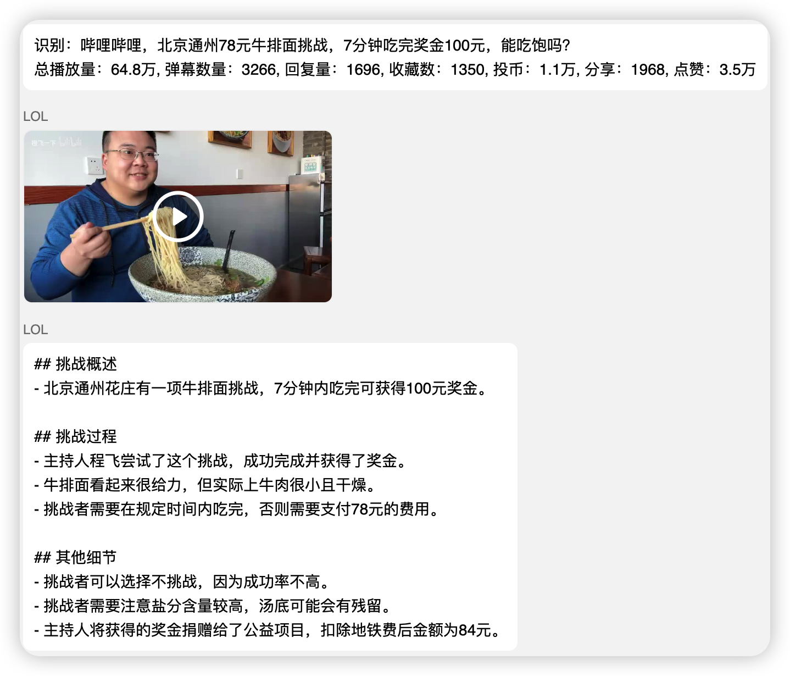
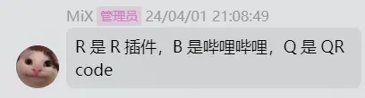
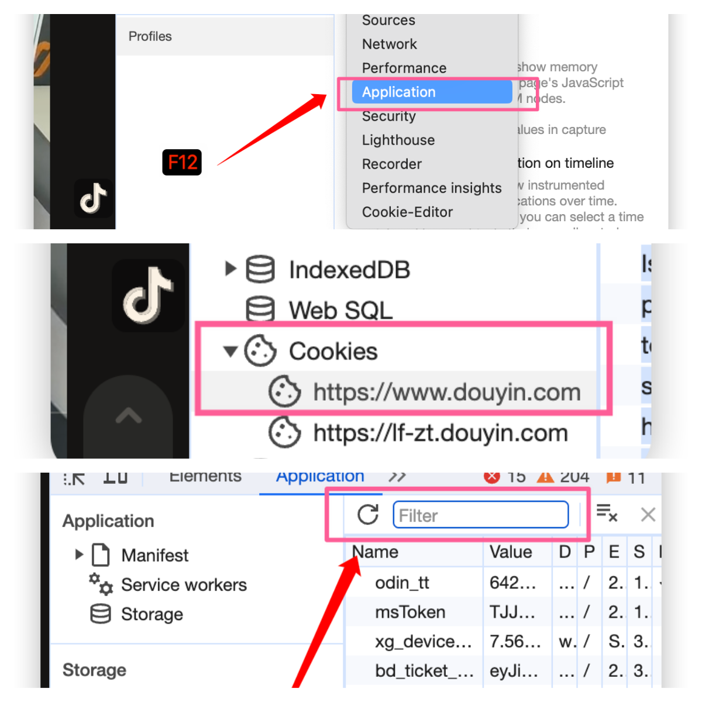
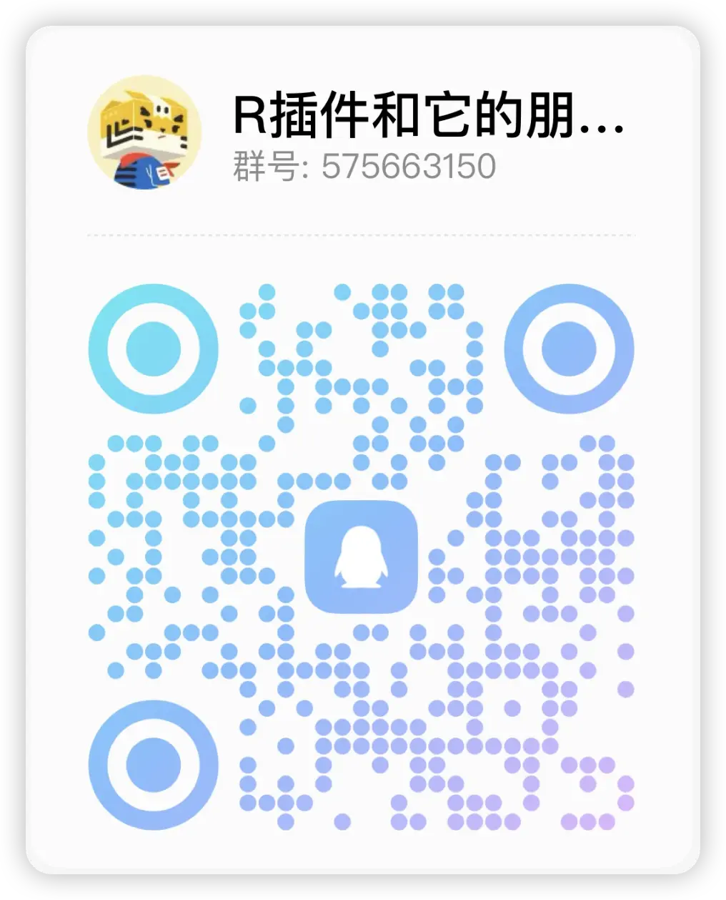
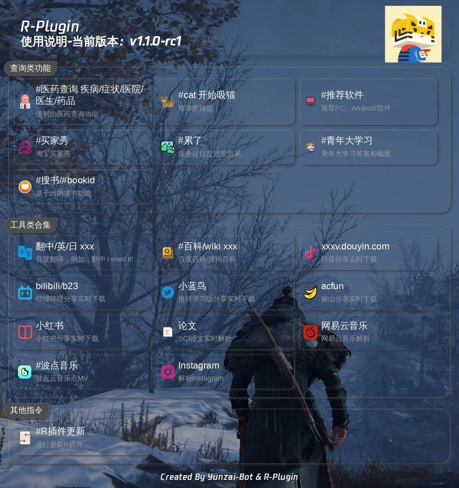

<p align="center">
  <a href="https://gitee.com/kyrzy0416/rconsole-plugin">
    
  </a>
</p>


<div align="center">
    <h1>R-plugin</h1>
    写给朋友们用的<a href="https://gitee.com/Le-niao/Yunzai-Bot" target="_blank">Yunzai-Bot</a>插件，插件的各种业务来源于周围人

</div>

> 📢 推荐 TG 个人互联网分享频道（分享日常冲浪互联网看到好玩的网站、app应用）：[RrOrange和朋友们](https://t.me/RrOrangeAndFriends)
## 🗃️ 文件架构
apps -- 业务核心

config -- 配置文件

img -- README图片

model -- 核心文件

resource -- 资源文件

utils -- 工具类


## 🧏 ‍使用实例







## 📔 使用说明

1.【必要】下载插件
```shell
# 国内
git clone https://gitee.com/kyrzy0416/rconsole-plugin.git ./plugins/rconsole-plugin/
# 海外
git clone https://github.com/zhiyu1998/rconsole-plugin.git ./plugins/rconsole-plugin/
```

2.【必要】在`Yunzai-Bot / Miao-Yunzai`目录下安装axios(0.27.2)、魔法工具（tunnel）、二维码处理工具（qrcode）、高性能下载队列（p-queue）


```shell
pnpm i -P --prefix ./plugins/rconsole-plugin/
```


3.【可选】要使用`视频解析`功能要下载插件【推荐ubuntu系统】
```shell
# ubuntu
sudo apt-get install ffmpeg
# 其他linux参考（群友推荐）：https://gitee.com/baihu433/ffmpeg
# Windows 参考：https://www.jianshu.com/p/5015a477de3c
````

`油管解析`需要 `yt-dlp` 的依赖才能完成解析（三选一）：
```shell
# 三选一
# ubuntu （国内 or 国外，且安装了snap）
snap install yt-dlp
# debian 海外
curl -L https://github.com/yt-dlp/yt-dlp/releases/latest/download/yt-dlp -o ~/.local/bin/yt-dlp
chmod a+rx ~/.local/bin/yt-dlp
# debian 国内
curl -L https://ghproxy.net/https://github.com/yt-dlp/yt-dlp/releases/latest/download/yt-dlp -o ~/.local/bin/yt-dlp
chmod a+rx ~/.local/bin/yt-dlp
# archlinux
sudo pacman -Syu yt-dlp
```

4. 【可选】小程序解析适配了：
* 喵崽：[Yoimiya / Miao-Yunzai](https://gitee.com/yoimiya-kokomi/Miao-Yunzai)
* TRSS：[时雨◎星空 / Yunzai](https://gitee.com/TimeRainStarSky/Yunzai)
* 听语惊花：[听语惊花 / Yunzai-Bot-lite](https://gitee.com/Nwflower/yunzai-bot-lite)

> 如果解析有问题参考issue：[#I6MFF7](https://gitee.com/kyrzy0416/rconsole-plugin/issues/I6MFF7)
> [#I7KQVY](https://gitee.com/kyrzy0416/rconsole-plugin/issues/I7KQVY)


5. 【可选】对哔哩哔哩解析进行总结：需要填写哔哩哔哩的SESSDATA



6. 【可选】增加视频的时长限制（默认8分钟(60 * 8 = 480)）：
- 在config/tools.yaml里设置`biliDuration`
- 锅巴设置

7. 【可选 & 慎重】下载指定版本的R插件：
如果你觉得当前版本的功能出现了问题，那么可以下载指定版本的插件，比如`1.5.1`：
```shell
# 删除当前的R插件
rm -rf ./plugins/rconsole-plugin/
# 克隆指定版本的R插件
git clone -b 1.5.1 https://gitee.com/kyrzy0416/rconsole-plugin.git
```

##  🐤 Q&A
### B站扫码登录
命令：`#RBQ`，来自2024/4/1 才子 `Mix` 的命名



示例：


### 🎵 douyin问题
由于douyin的解析变化莫测，现版本需要填入自己的cookie，具体步骤如下：
1. 打开`https://www.douyin.com/` 扫码登入自己的账号
2. F12进入控制台，或者下载一个[Cookie-Editor](https://www.crxsoso.com/webstore/detail/hlkenndednhfkekhgcdicdfddnkalmdm)
3. 如果是F12，就将以下参数填入到`tools.yaml - douyinCookie`，或者使用锅巴
> odin_tt=xxx;passport_fe_beating_status=xxx;sid_guard=xxx;uid_tt=xxx;uid_tt_ss=xxx;sid_tt=xxx;sessionid=xxx;sessionid_ss=xxx;sid_ucp_v1=xxx;ssid_ucp_v1=xxx;passport_assist_user=xxx;ttwid=xxx;

3. 如果是`Cookie-Editor`就直接到插件复制到`tools.yaml - douyinCookie`，或者锅巴

具体图示，找以下这几个：
- odin_tt
- passport_fe_beating_status
- sid_guard
- uid_tt
- uid_tt_ss
- sid_tt
- sessionid
- sessionid_ss
- sid_ucp_v1
- ssid_ucp_v1
- passport_assist_user
- ttwid



### ✖️ 小蓝鸟问题
**2024-2-5**，修复小蓝鸟的时候看到free计划已经[没有给查看Tweet的api](https://developer.twitter.com/en/portal/products/basic)，原先[使用的库也出现了403报错](https://github.com/PLhery/node-twitter-api-v2)，开通会员要100美元，不值得。目前暂停更新，后续有方案和精力再更新！

> 2024/2/26 目前的替代方案：使用第三方解析，但是无法解析组图，只能解析单个图片，望周知！

##  🤺 R插件交流群
扫码不行就：575663150



## 🧑‍🌾 进阶内容
【可选】相关配置(apps/tools.js)：
> `百度翻译`api:https://fanyi-api.baidu.com/doc/21  
> 注册完填入方式参考上方注释url (config/tools.yaml)；另外，有群友反馈百度翻译需要充钱才能使用！

> (非必要不更改)更改魔法在`config/tools.yaml` 或 [锅巴插件](https://gitee.com/guoba-yunzai/guoba-plugin)的配置位置：  
`proxyAddr: '127.0.0.1' # 魔法地址`  
`proxyPort: '7890' # 魔法端口`

> 海外服务器示例：  
直接发送`#设置海外解析`


## 📦 业务


## 📝 计划功能
- [x] YouTube解析（这个可能要🕊一久）
- [ ] Instagram解析修复
  - [ ] 单张图片解析
  - [ ] 视频解析
- [x] 哔哩哔哩总结
- [x] xhs解析去水印
- [x] kuai_shou解析
- [x] xi_gua视频解析
- [ ] ...


## 🔗 链接

- [云崽](https://gitee.com/yoimiya-kokomi/Yunzai-Bot)
- [云崽轻量级](https://gitee.com/Nwflower/yunzai-bot-lite)
- [插件库](https://gitee.com/Hikari666/Yunzai-Bot-plugins-index)

## 🙏 贡献
🌸 感谢下面的朋友对我插件的贡献（排名不分高低）
* [好冷](https://gitee.com/hetangx) 提供Windows解决方案
* [一杯凉](https://gitee.com/yibeiliang) 提供小程序解析冲突解决方案
* [x0rz4](https://gitee.com/x0rz4) 提供依赖掉包解决方案


🌸 同时鸣谢感谢以下开发者对 `R插件` 出的贡献：

<a href="https://github.com/zhiyu1998/rconsole-plugin/graphs/contributors">
  
</a>

🌸 感谢以下框架的开源：
- [yt-dlp:A youtube-dl fork with additional features and fixes](https://github.com/yt-dlp/yt-dlp)

##  ☕ 请我喝一杯瑞幸咖啡
如果你觉得插件能帮助到你增进好友关系，那么你可以在有条件的情况下[请我喝一杯瑞幸咖啡](https://afdian.net/a/zhiyu1998)，这是我开源这个插件的最大动力！
感谢以下朋友的支持！（排名不分多少）

> ps. 如果你是学生建议把钱花在饭卡上，谢谢你对R插件喜欢！

|       昵称        | 赞助   |
|:---------------:|------|
|      为爱发巅       | 1杯瑞幸 |
|       丘丘莹       | 5    |
|    Allweknow    | 1杯瑞幸 |
|      MNJv       | 5    |
|        n        | 4杯瑞幸 |
|       一杯凉       | 30   |
| 左轮（ps. 我导师，泪目！） | 1杯瑞幸 |
| mitsuha / 下次一定  | 4杯瑞幸 |
|    [Kr] 5s¹     | 1杯瑞幸 |
|     春日野穹OvO     | 25   |
|       MiX       | 30   |

## 🚀 声明
* 文件借鉴了很多插件，精简个人认为可以精简的内容。
* 素材来源于网络，仅供交流学习使用
* 严禁用于任何商业用途和非法行为
* 如果对你有帮助辛苦给个star，这是对我最大的鼓励
