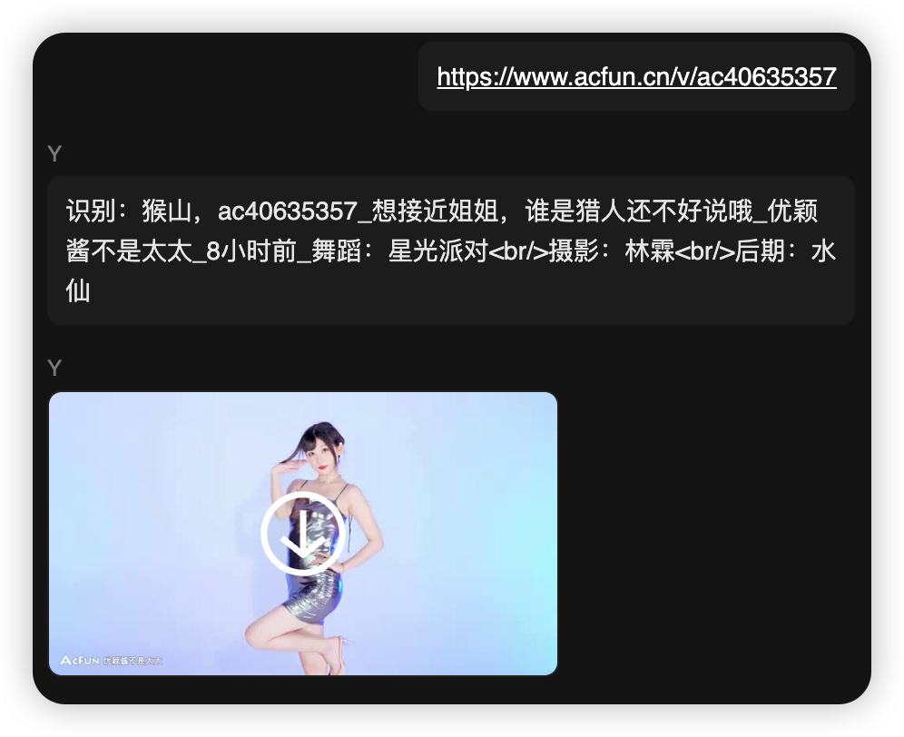
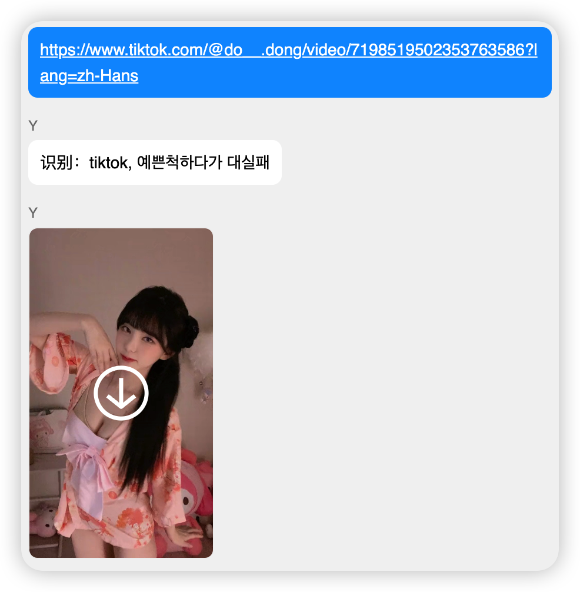
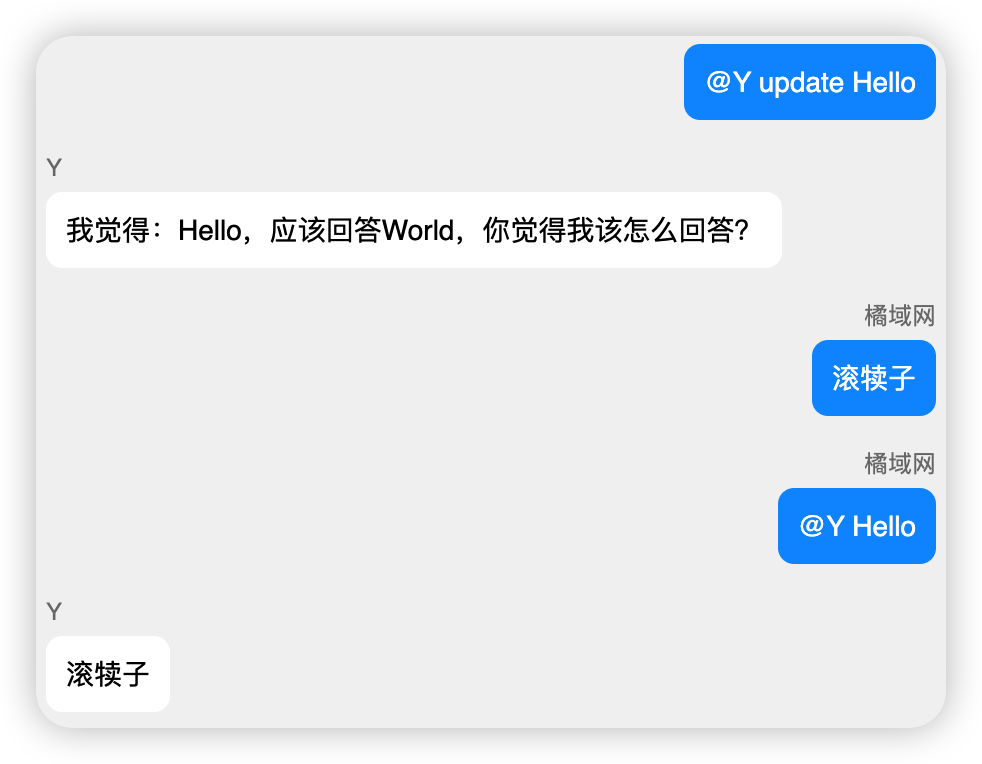
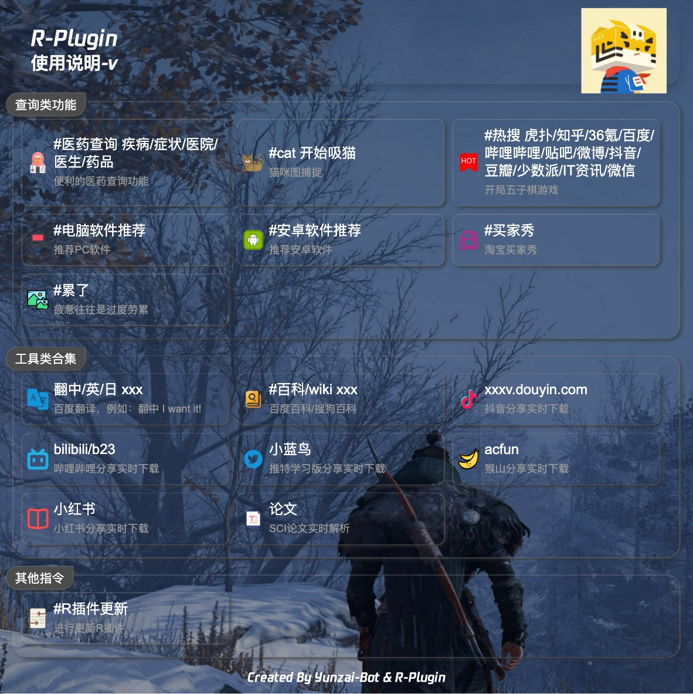

<p align="center">
  <a href="https://gitee.com/kyrzy0416/rconsole-plugin">
    
  </a>
</p>

<div align="center">
    <h1>R-plugin</h1>
    写给朋友们用的<a href="https://gitee.com/Le-niao/Yunzai-Bot" target="_blank">Yunzai-Bot</a>插件，插件的各种业务来源于周围人

</div>

## 🗃️ 文件架构
apps -- 业务核心

config -- 配置文件

img -- README图片

model -- 核心文件[建议不动]

resource -- 资源文件

utils -- 工具类


## 🧏 ‍使用实例






## 📔 使用说明

1.【必要】下载插件
```shell
git clone https://gitee.com/kyrzy0416/rconsole-plugin.git ./plugins/rconsole-plugin/
``````

2.【必要】在`Yunzai-Bot`目录下安装axios(0.27.2)、魔法工具（tunnel）、哔哩哔哩总结(chatgpt-api)依赖


```shell
pnpm i -P --prefix ./plugins/rconsole-plugin/
```


3.【可选】要使用`视频解析`功能要下载插件【推荐ubuntu系统】
```shell
# ubuntu
sudo apt-get install ffmpeg
# 其他linux参考（群友推荐）：https://gitee.com/baihu433/ffmpeg
# Windows 参考：https://www.jianshu.com/p/5015a477de3c
````
4. 【可选】小程序解析仅适配了[Yoimiya/Yunzai-Bot](https://gitee.com/yoimiya-kokomi/Yunzai-Bot)

如果解析有问题参考issue：[#I6MFF7](https://gitee.com/kyrzy0416/rconsole-plugin/issues/I6MFF7)


5. 【可选】对哔哩哔哩解析进行总结：需要填写openaiApiKey和哔哩哔哩的SESSDATA


> 哔哩哔哩的SESSDATA？
>
> 进入哔哩哔哩网站 -- 打开F12开发者选项 -- 应用 -- 找到Cookie -- 找到SESSDATA -- 复制 -- 粘贴到plugins/rconsole-plugin/config/tools.yaml or 锅巴  
> [图文教程【群友推荐！】](https://www.bilibili.com/read/cv12349604)

> 如何获取openaiApiKey？
>
> 1. 要有一个openai的账号（https://chat.openai.com/）
> 2. 获取api-key参考（https://www.cnblogs.com/botai/p/openai_apikey.html）

注：以上条件缺一不可（**SESSDATA+OpenAiApiKey+魔法**），不然无法触发

## 🧑‍🌾 进阶内容
【可选】相关配置(apps/tools.js)：
> `百度翻译`api:https://fanyi-api.baidu.com/doc/21  
注册完填入方式参考上方注释url (config/tools.yaml)；另外，有群友反馈百度翻译需要充钱才能使用！

> (非必要不更改)更改魔法在`config/tools.yaml` 或 [锅巴插件](https://gitee.com/guoba-yunzai/guoba-plugin)的配置位置：  
`proxyAddr: '127.0.0.1' # 魔法地址`  
`proxyPort: '7890' # 魔法端口`
## 📦 业务


## 📝 计划功能
- [ ] YouTube解析（这个可能要🕊一久）
- [x] Instagram解析
  - [ ] 单张图片解析
  - [ ] 视频解析
- [x] 哔哩哔哩总结
- [ ] 精简工具功能冗余代码
- [ ] 自由修改插件优先级
- [ ] ...


## 🔗 链接

- [云崽](https://gitee.com/yoimiya-kokomi/Yunzai-Bot)
- [插件库](https://gitee.com/Hikari666/Yunzai-Bot-plugins-index)

## 🙏 贡献
感谢下面的朋友对我插件的贡献（排名不分高低）
* [好冷](https://gitee.com/hetangx) 提供Windows解决方案
* [一杯凉](https://gitee.com/yibeiliang) 提供小程序解析冲突解决方案
* [x0rz4](https://gitee.com/x0rz4) 提供依赖掉包解决方案

##  ☕ 请我喝一杯瑞幸咖啡
如果你觉得插件能帮助到你增进好友关系，那么你可以在有条件的情况下[请我喝一杯瑞幸咖啡](https://afdian.net/a/zhiyu1998)，这是我开源这个插件的最大动力！
感谢以下朋友的支持！（排名不分多少）

|       昵称        | 赞助   |
|:---------------:|------|
|      为爱发巅       | 1杯瑞幸    |
|       丘丘莹       | 5    |
|    Allweknow    | 1杯瑞幸 |
|      MNJv       | 5    |
|        n        | 4杯瑞幸 |
|       一杯凉       | 30   |
| 左轮（ps. 我导师，泪目！） | 1杯瑞幸 |
|     mitsuha     | 1杯瑞幸 |
|    [Kr] 5s¹     | 1杯瑞幸 |

##  👩‍👩‍👧‍👧 开发团队
| Nickname                                                     | Contribution |
| :----------------------------------------------------------: |--------------|
|[易曦翰](https://gitee.com/yixihan) | 后端开发         |
|[zhiyu](https://gitee.com/kyrzy0416) | 后端开发         |
|[Diviner](https://gitee.com/divinerJJ) | 前端开发         |
|[小白白](https://gitee.com/little_White01) | 后端开发         |

## 🚀 后记
* 文件借鉴了很多插件，精简个人认为可以精简的内容。 
* 素材来源于网络，仅供交流学习使用 
* 严禁用于任何商业用途和非法行为 
* 如果对你有帮助辛苦给个star，这是对我最大的鼓励
