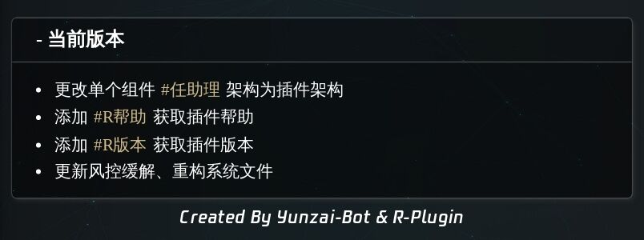

<p align="center">
  <a href="https://gitee.com/kyrzy0416/rconsole-plugin">
    
  </a>
</p>

<div align="center">
    <h1>R-plugin</h1>
    个人团队用的<a href="https://gitee.com/Le-niao/Yunzai-Bot" target="_blank">Yunzai-Bot</a>插件，插件的各种业务来源于周围人

</div>

## 🗃️文件架构
apps -- 业务核心

config -- 配置文件

model -- 核心文件[建议不动]

resource -- 资源文件

test -- 爬虫文件[python]

index -- 主入口

##  🧏‍♂️使用实例


##  🤺BUG及时交流群


## 📔使用说明
【重要】【重要】【重要】 很多群友反馈Windows用不了部分功能，但是插件本身在Linux运行了半年之久（推荐使用Linux），所以酌情安装！！  

1. 【可选】下载mongodb（可能会耗费一些时间：影响功能【`#我靠`】）
> linux系统下自己装一个mongodb，上一个密码(不上有风险)
2. 【可选】`test -- main.py`爬取链接（要有python环境、配合mongodb使用）
> python3 main.py
3. 【必要】在`Yunzai-Bot`安装mongodb、axios(0.27.2)、代理工具（tunnel）、TwitterAPI依赖
> pnpm add mongodb axios tunnel twitter-api-v2 -w

4. 【必要】下载插件
> git clone https://gitee.com/kyrzy0416/rconsole-plugin.git ./plugins/rconsole-plugin/

> 注：可以不用mongodb这些操作，只是用不了一些命令而已
5. 【可选】要使用视频解析功能要下载插件【推荐ubuntu系统】
> sudo apt-get install ffmpeg

【可选】备注：考虑到不是所有电脑都有mongodb,如果要开启`#我靠`功能，需要把以下代码(apps/mystery.js)注释取消：
```javascript
// in apps/mystery.js

// Mongodb初始化
import mongodb from 'mongodb'

// Mongodb初始化
function initMongo () {
    const MongoClient = mongodb.MongoClient
    const url = 'mongodb://localhost:27017/'
    return new Promise((resolve, reject) => {
        MongoClient.connect(url, (err, db) => {
            const dbo = db.db('test')
            if (err) {
                throw err // 和调用 reject(err) 效果类似
            }
            let collection = dbo.collection('temp')
            resolve(collection)
        })
    })
}

const mongo = initMongo()
// ...
{
    reg: '^#我靠', fnc: 'tuiimg'
}
// ...
async tuiimg (e) {
    const MAX_SIZE = this.mysteryConfig.tuiimg.count
    this.reply('这群早晚被你整没了...')
    let images = []
    const template = {
        nickname: this.e.sender.card || this.e.user_id, user_id: this.e.user_id
    }
    await mongo.then(conn => {
        return conn.aggregate([ { $sample: { size: MAX_SIZE } } ]).toArray()
    }).then((result) => {
        result.forEach((item) => {
            images.push({
                message: segment.image(item.url), ...template
            })
        })
    })
    return !!(await this.reply(await Bot.makeForwardMsg(images), false, {
        recallMsg: recallTime
    }))
}
```

【可选】相关配置(apps/tools.js)：
> twiiter-api:https://developer.twitter.com/en  
> 百度翻译api:https://fanyi-api.baidu.com/doc/21  
## 📦业务


## 🤳版本


## 开发团队
| Nickname                                                     | Contribution |
| :----------------------------------------------------------: |--------------|
|[易曦翰](https://gitee.com/yixihan) | 后端开发         |
|[zhiyu](https://gitee.com/kyrzy0416) | 后端开发         |
|[Diviner](https://gitee.com/divinerJJ) | 前端开发         |
|[小白白](https://gitee.com/little_White01) | 后端开发         |

## 🚀后记
* 文件借鉴了很多插件，精简个人认为可以精简的内容。 
* 素材来源于网络，仅供交流学习使用 
* 严禁用于任何商业用途和非法行为 
* 如果对你有帮助辛苦给个star，这是对我最大的鼓励